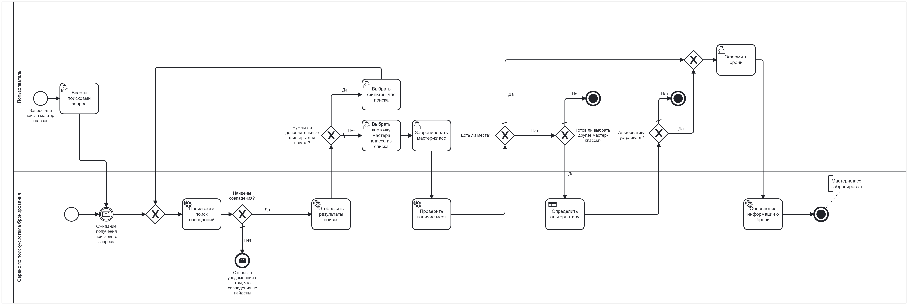
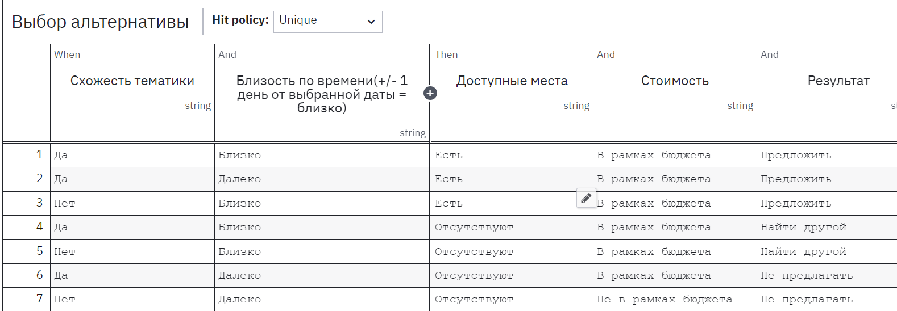

# Моделирование бизнес-процесса по поиску бронированию мероприятия

--- 

## BPMN диаграмма

## DMN таблица

**Обоснование использования DMN**:
этот этап отвечает за принятие решения, которое позволяет предложить МК пользователю в случае отсутствия мест или других ограничений. Решение об альтернативе зависит от нескольких факторов (схожесть тематики, близость по дате, доступность мест и соответствие стоимости бюджету). DMN позволяет формализовать все эти правила в таблице. И если потом нужно будет пересмотреть критерии выбора или добавить новые условия, это можно сделать, изменив только содержимое DMN таблицы, не затрагивая основной процесс

