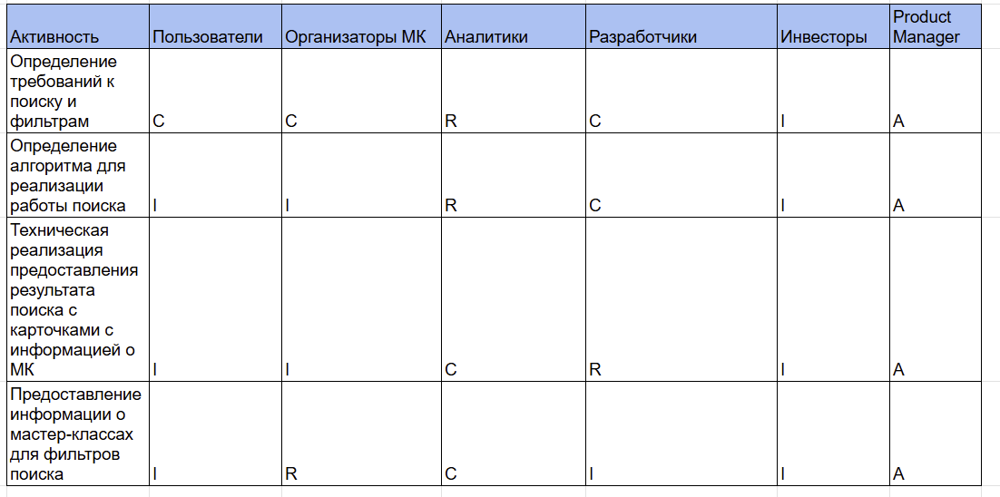
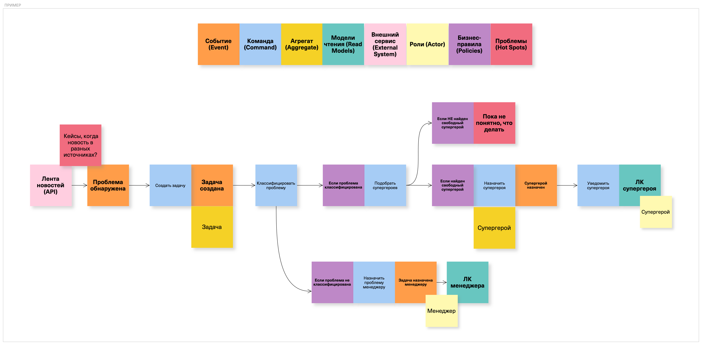

### **1. Классификация стейкхолдеров по матрице RACI**

**Определение требований к поиску и фильтрам:**

- Пользователи  C, потому что они дают обратную связь по тому, какие способы поиска и фильтрации им удобнее.

- Организаторы C, потому что также предоставляют обратную связь по тому, на какие критерии популярны среди пользователей

- Аналитики R, потому что они как раз анализируют данные со всех источников и формируют список критериев для поиска

- Разработчики C, потому  что консультирую по вопросам возможностей системы и технической реализации.

- Инвесторы I, потому что информируются о функционале системы и его роли в привлечении аудитории.

- Product manager A,  потому что несет ответственность за результат.

**Определение алгоритма для реализации работы поиск**

- Пользователи  I, потому что они информируются о критериях, которые будут использоваться в алгоритме, чтобы знать, как их запросы будут обрабатываться

- Организаторы I, потому что также информируются о критериях, которые используются в алгоритме, что поможет им заполнять параметры мероприятий, так, чтобы привлечь большее количество пользователей.

- Аналитики R, потому что они отвечают за разработку и выбор алгоритма на основе собранных данных, и отвечают за то, чтобы алгоритм был эффективным.

- Разработчики C, потому  что консультирую по вопросам возможностей системы и технической реализации.

- Инвесторы I, потому что информируются о том, как будет работать алгоритм поиска, и как он будет способствовать улучшению пользовательского опыты.

- Product manager A,  потому что несет ответственность за итоговый результат, принимая во внимание стратегические цели проекта.

**Техническая реализация предоставления результата поиска с карточками с информацией о МК**

- Пользователи I, потому что они информируются о результатах реализации представления карточек с информацией о МК.

- Организаторы I, потому что они информируются о результатах реализации представления карточек с информацией о МК.

- Аналитики C, потому что они консультируют по вопросам реализации, предоставляя проанализированные данные о пользователях, что помогает в создании интуитивно понятного и удобно интерфейса.

- Разработчики R, потому что они отвечают за реализацию интерфейса с результатами поиска.

- Инвесторы I, потому что они информируются о ходе разработки и о том, как функционал поможет улучшить пользовательский опыт и повлияет на увеличении прибыли.

- Product manager A,  потому что несет ответственность за итоговый результат и отвечает за соответствие реализации требованиям и пользовательскому опыту.

**Предоставлении информации о МК для фильтров поиска**

- Пользователи I, потому что информируются о том, какие данные доступны для фильтрации 

- Организаторы R, потому что предоставляют и обновляются информацию о своих МК, которая будет использоваться для фильтрации поисковых запросов пользователей.

- Аналитики C, потому что консультируют о том, какие данные наиболее важны для фильтрации

- Разработчики I потому что проинформированы о том, какие данные будут предоставлены.

- Инвесторы I, потому что информируются о том, как предоставление подробной информации для фильтров улучшит пользовательский опыт.

- Product manager A,  потому что что несет ответственность за итоговый результат и отвечает за обеспечение соответствия информации требованиям фильтров и актуальность данных.

### **2. Составление списка вопросов для интервью**

### Вопросы для интервью со стейкхолдерами

**Вопросы к пользователям и организаторам**

1. **Какую информацию о мастер-классах вы считаете наиболее важной для поиска?
Цель**: узнать, какие параметры (дата, категория, стоимость и т.д.) являются критически важными для пользователей и организаторов при поиске мероприятий.

2. **Какие фильтры поиска вы хотели бы видеть в системе?
Цель**: понять, какие конкретные фильтры поиска нужны стейкхолдерам для более точного поиска мероприятий.

3. **Как вы обычно ищете мероприятия? Какой метод поиска для вас наиболее удобен?
Цель**: понять привычки пользователей и организаторов в поиске, чтобы создать более интуитивный интерфейс.

4. **Насколько важна для вас возможность сохранять поисковые фильтры и настройки?
Цель**: определить, нужно ли реализовывать функцию сохранения фильтров и настроек для удобства пользователей.

5. **Какие устройства (мобильные, планшеты, ПК) вы предпочитаете использовать для поиска мероприятий?
Цель**: узнать, на каких устройствах пользователи будут искать мероприятия, чтобы оптимизировать интерфейс под разные платформы.

6. **Какой тип уведомлений о новых мероприятиях был бы вам полезен?
Цель**: определить, как лучше информировать пользователей о новых мероприятиях, чтобы они оставались вовлеченными и не пропустили интересные мастер-классы.

7. **Как вы оцениваете важность отзывов и рейтингов при поиске мероприятий?
Цель**: узнать, насколько важна информация о рейтингах и отзывах для принятия решения о записи на мастер-класс.

8. **Как вы представляете идеальный процесс поиска мероприятий? Какие шаги он должен включать?
Цель**: получить представление о том, как пользователи видят идеальный сценарий поиска, чтобы учесть это в дизайне и логике функционала.

**Для инвесторов:**

**Как вы оцениваете потенциал роста доходов от внедрения функционала поиска с фильтрами?
Цель**: узнать, какие ожидания инвесторы имеют относительно финансовых результатов от внедренного функционала

**Для аналитиков:**

1. **Какие данные о пользователях вы считаете полезными для улучшения алгоритма поиска?
Цель**: понять, какие данные могут помочь в создании более эффективного поиска.

2. **Как вы будете оценивать эффективность алгоритма поиска? Какие инструменты для этого вы планируете использовать?
Цель**: понять, какие метрики и инструменты аналитики будут использовать для оценки эффективности.

**Для разработчиков:**

1. **Какие возможности вы видите для будущего масштабирования системы поиска?**
Цель: узнать, как разработчики планируют обеспечить масштабируемость функционала, чтобы справляться с растущими объемами данных и запросов.

2. **Какие технически сложности могут возникнуть при интеграции системы поиска с фильтрами в данную систему?
Цель**: определить возможные технические сложности, чтобы заранее предусмотреть пути решения и минимизировать риски.

### **3. Построение Event Storming для бизнес-процесса**

**Решение представлено на доске по ссылке:
Поиск и бронирование мастер классов:**
[https://unidraw.io/board/95ce557ea3c1f11b9c6b](https://unidraw.io/board/95ce557ea3c1f11b9c6b)

